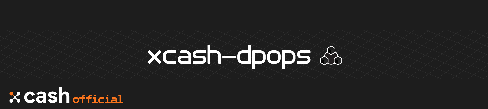

<div align=middle>

<a align="center" href="https://x-network.io/xcash"></a>

[](https://discordapp.com/invite/4CAahnd)
[](https://opensource.org/licenses/MIT)

</div>

# X-Cash Delegated Proof of Private Stake

🗳️ The **X-Cash Delegated Proof of Private Stake** (`xcash-dpops`) is a custom variation of a DPoS with DBFT consensus made with privacy coin from the CryptoNote legacy in mind.
The **[X-Cash](https://github.com/X-Cash-Official/xcash-core)** Public Network is governed by delegates elected by XCASH holders to secure and forge new blocks. 

## Table of Content 

  - [Table of Content](#table-of-content)
  - [Features](#features)
  - [License](#license)
  - [Contributing](#contributing)
  - [Documentation](#documentation)
  - [Security](#security)
  - [Installation](#installation)
  - [Important Links](#important-links)

## Features

Implementing a **Delegated Proof of Stake** and **Delegated Byzantine Fault Tolerance** consensus in a privacy-based cryptocurrency presents a challenge. Taking inspiration from successful blockchain governance systems, **X-Cash Delegated Proof of Private Stake** proposes a unique solution to bring DPOS and DBFT based consensus to the privacy coin space.

### **Staking**
The **X-Cash Public Network** is secured by delegates, elected in their position by XCASH holders. By providing your **vote through a stake in XCASH**, you are electing a representative to secure the network and forge new blocks, which will in return **split the block reward with you**.

### **DBFT** 
The unique implementation of **DBFT** into the consensus process enables the X-Cash blockchain to become **immune to forks**, henceforth instantly validating new transactions.

### **Randomized Block Producer Selection**  
The selection of the next delegate in charge of forging a block is **completely randomized** through the use of **Verifiable Random Functions (VRF)**, increasing the security of the delegates by preventing attacks to the next block producer.

### **Stake Delegation with Reserve Proofs**
Instead of sending your stake to another wallet to vote toward a delegate, you are providing a **cryptographic reserver proof** of your funds to your delegate, meaning that **you keep complete control of your stake at all times**.


> *Have a look at our* 📜 *[Delegated Proof-of-Private-Stake](https://x-network.io/whitepaper/XCASH_Yellowpaper_DPoPS.pdf) yellow paper to learn more about the technical challenge of integrating this consensus on a Monero-based privacy coin.*


## License

**X-Cash is an open-source project managed by the X-Cash Foundation**.  
We are operating under the [MIT License](LICENSE).

## Contributing

**Thank you for thinking of contributing! 😃**   
If you want to help out, fork the repository, check [CONTRIBUTING](https://github.com/X-CASH-official/.github/blob/master/CONTRIBUTING.md) for a set of guidelines, and check our [opened issues](https://github.com/X-CASH-official/xcash-core/issues).

## Documentation

We are hosting our documentation on **GitBook** 👉 [**docs.xcash.foundation**](https://docs.xcash.foundation/)

> You can contribute directly on our [`gitbook-docs`](https://github.com/X-CASH-official/gitbook-docs) repository.

## Security 

If you discover a security vulnerability, please send an e-mail to [security@xcash.foundation](mailto:security@xcash.foundation).  
All security vulnerabilities concerning the X-Cash blockchain will be promply addressed.

## Installation

> Every steps of the installation and build instructions are described in our [detailed guide](https://docs.xcash.foundation/dpops/get-started). 

### System Requirements

> In the first beta version, `xcash-dpops` will only run on a **Linux/Unix OS**. We recommend installing it on a Ubuntu VPS/dedicated server (18.04) for best compatibility.

The **recommended** system requirement is designed to be ***future-development proof***, meaning that an hardware update should never be needed and still comfortably handle the `xcash-dpops` program.

|                    | Minimum                                | Recommended                              |
|--------------------|----------------------------------------|---------------------------------------|
| **OS**                 | Ubuntu 18.04                           | Ubuntu 18.04                          |
| **CPU**                | 4 threads, 2.0 GHz or more per thread  | 4 threads, 2.0 GHz or more per thread |
| **RAM**                | 6GB                                    | 32GB                                  |
| **Hard Drive**         | 50GB                                   | 2TB                                   |
| **Bandwidth Transfer** | 100GB per month                        | 500GB per month                       |
| **Bandwidth Speed**   | 100 Mbps                               | 500 Mbps                              |

### Dependencies

The following table summarizes the tools and libraries required to run X-Cash's DPoPS program.

| Dependencies | Min. version | Ubuntu package |
| :--- | :--- | :--- |
| **GCC** | 4.7.3 | `build-essential` |
| **CMake** | 3.0.0 | `cmake` |
| **pkg**-**config** | any | `pkg-config` |
| **OpenSSL** | any | `libssl-dev` |
| **Git** | any | `git` |
| **MongoDB** | 4.0.3 | Install from [binaries](https://www.mongodb.com/download-center/community) |
| **MongoDB C Driver** \(includes BSON libary\) | 1.13.1 | Build from [source](https://github.com/mongodb/mongo-c-driver/releases/) |
| **`xcash-core`** | Latest version | [download the latest release](https://github.com/X-CASH-official/X-CASH/releases) or [build from source](https://github.com/X-CASH-official/X-CASH#compiling-x-cash-from-source) |

### Installation

To install the `xcash-dpops` program and the related services to set up a delegate node, have a look first at our [server setup guide](https://docs.xcash.foundation/dpops/server-setup). 

Then, run the `autoinstaller.sh` script and follow [our guide](https://docs.xcash.foundation/dpops/installation-process#installer-script).
```shell
bash -c "$(curl -sSL https://raw.githubusercontent.com/X-CASH-official/xcash-dpops/master/scripts/autoinstaller/autoinstaller.sh)"
```

> To build everything from source, follow our **[manual installation](https://github.com/X-CASH-official/android-wallet/releases)** guide.

## Important Links

### 🔗 MAIN LINKS
- **X-Network**: [x-network.io](https://x-network.io/)
- **X-Cash**: [x-network.io/xcash](https://x-network.io/xcash)
- **Block explorer**: [explorer.x-cash.org](https://explorer.x-cash.org/Explorer)
- **Medium**: [medium.com/x-cash](https://medium.com/x-cash)
- **Help Center**: [Help Portal](https://xcashteam.atlassian.net/servicedesk/)
- **Mining**: [/xcash/mining/](https://x-network.io/xcash/mining/)

### 👛 WALLET
- **Download**: [Official Download Page](https://x-network.io/xcash/downloads/)  
- **Paper wallet**: [X-Cash Paper Wallet Generator](https://x-network.io/xcash/paper-wallet-generator/)  
- **Android Wallet (beta)**: [Latest releases](https://github.com/X-CASH-official/android-wallet/releases)
- **Online Storage Solution**: [X-Bank](https://x-bank.io)

### 💱 SUPPORTED EXCHANGES
- **STEX**: [STEX.com](https://www.stex.com/)  
- **GRAVIEX**: [graviex.net](https://graviex.net/)  
- **CITEX**: [citex.co.kr](https://www.citex.co.kr/)  

### 🌍 COMMUNITY
- **Twitter**: [@xcashcrypto](https://twitter.com/XCashCrypto)  
- **Discord**: [discord.gg/4CAahnd](https://discord.gg/4CAahnd)  
- **BitcoinTalk**: [bitcointalk.org/index.php?topic=4781246](https://bitcointalk.org/index.php?topic=4781246)  
- **Reddit**: [r/xcash/](https://www.reddit.com/r/xcash)  
- **Telegram**: [t.me/xcashglobal](https://t.me/xcashglobal)